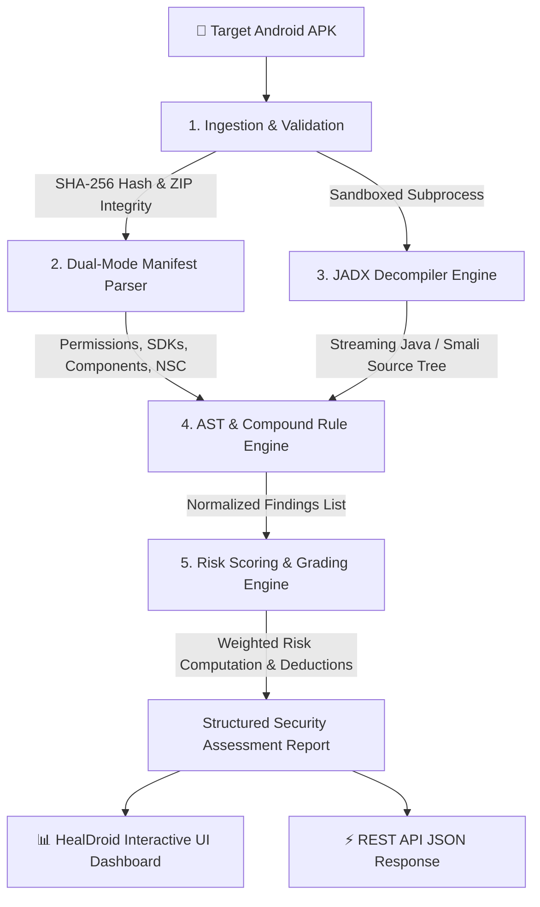

# 🛡️ HealDroid — Enterprise-Grade Static APK Security Analyzer

[](https://www.python.org/)
[](https://fastapi.tiangolo.com/)
[](https://react.dev/)
[](https://www.typescriptlang.org/)
[](https://vitejs.dev/)
[](https://owasp.org/www-project-mobile-top-10/)
[]()
[](LICENSE)

**HealDroid** is an advanced static application security testing (SAST) platform engineered specifically for Android APKs. It combines binary manifest parsing, high-throughput JADX decompilation, a declarative multi-pattern AST & compound rule engine, weighted OWASP risk scoring, and instant developer remediation snippets within a responsive mobile-first dashboard.

---

## 📑 Table of Contents
- [Architecture & Processing Pipeline](#-architecture--processing-pipeline)
- [Key Capabilities](#-key-capabilities)
- [OWASP Mobile Top 10 Security Rule Matrix](#-owasp-mobile-top-10-security-rule-matrix)
- [Scoring & Grading Methodology](#-scoring--grading-methodology)
- [Security & Safe Execution Sandboxing](#-security--safe-execution-sandboxing)
- [API Reference](#-api-reference)
- [Getting Started](#-getting-started)
  - [Prerequisites](#prerequisites)
  - [1. Decompiler Setup](#1-portable-jadx-decompiler-setup)
  - [2. Backend Engine](#2-backend-engine-fastapi)
  - [3. Frontend Dashboard](#3-frontend-dashboard-react--vite)
  - [4. Test APK Generation](#4-generate-vulnerable-test-apk-fixtures)
- [Verification & Automated Test Suite](#-verification--automated-test-suite)
- [Project Structure](#-project-structure)
- [Responsible Disclosure & Ethical Usage](#-responsible-disclosure--ethical-usage)
- [License](#-license)

---

## 🏗 Architecture & Processing Pipeline

HealDroid executes static security analysis across a 5-stage decoupled pipeline:



### Pipeline Breakdown
1. **Ingestion Layer**: Validates ZIP container headers, verifies file size limits, and generates cryptographic integrity hashes (SHA-256).
2. **Dual-Mode Manifest Parser**: Parses binary `AndroidManifest.xml` via Androguard with automatic fallback to XML ElementTree. Extracts `targetSdkVersion`, `minSdkVersion`, `networkSecurityConfig`, debug flags, backup configurations, requested permissions, and exported components.
3. **Decompilation & Extraction Layer**: Executes an isolated JADX decompiler subprocess with configurable timeout limits, streaming source files on-demand without memory bottlenecks.
4. **Security Rule Engine**: Evaluates 20+ declarative manifest rules, regex code patterns, and compound AST heuristics mapped to OWASP Mobile Top 10 categories.
5. **Risk Aggregation & Scoring**: Deducts weighted penalties per vulnerability category, maps scores (0–100) to letter grades (A–F), and produces developer-ready remediation snippets.

---

## ⚡ Key Capabilities

- **Deep Manifest Inspection**: Detects implicit component exports, missing permission guards, debuggable flags, and insecure backup policies.
- **Secret & Key Hunter**: Detects hardcoded AWS credentials (`AKIA...`), JWT tokens, private keys, and credential literals.
- **Cryptographic Flaw Detection**: Flags weak ciphers (DES/3DES, Blowfish), insecure modes (AES-ECB), weak hashing (MD5, SHA-1), and predictable pseudo-random number generators (`java.util.Random`).
- **Network & TLS Security**: Scans for cleartext HTTP communications, custom insecure `TrustManager` implementations, and disabled hostname verifiers (`ALLOW_ALL_HOSTNAME_VERIFIER`).
- **Code Injection & IPC Protection**: Flags dynamic raw SQL query concatenations, world-readable storage modes, and insecure WebView JavaScript bridges (`setJavaScriptEnabled(true)` + `addJavascriptInterface`).
- **Developer Remediation Guidance**: Every detected finding includes copy-paste compliant code snippets (e.g., OkHttp `CertificatePinner`, `EncryptedSharedPreferences`, `SQLCipher`, and Android KeyStore implementations).

---

## 🛡 OWASP Mobile Top 10 Security Rule Matrix

| Rule ID | Severity | OWASP Category | Target Vector | Description |
| :--- | :---: | :---: | :--- | :--- |
| `MANIFEST_DEBUGGABLE` | **CRITICAL** | M1: Platform Usage | `AndroidManifest.xml` | Application has `android:debuggable="true"` enabled. |
| `SECRET_AWS_KEY` | **CRITICAL** | M9: Reverse Engineering | Java Source | Hardcoded AWS Access Key ID (`AKIA[0-9A-Z]{16}`). |
| `INSECURE_TRUST_ALL_CERTS` | **CRITICAL** | M3: Communication | Java Source | TLS/SSL certificate validation bypassed via custom TrustManager. |
| `INSECURE_WEBVIEW_JS` | **CRITICAL** | M1: Platform Usage | Java Source | WebView JavaScript enabled alongside `addJavascriptInterface`. |
| `MANIFEST_EXPORTED_ACTIVITY` | **HIGH** | M1: Platform Usage | `AndroidManifest.xml` | Activity exported without explicit `android:permission` enforcement. |
| `MANIFEST_EXPORTED_RECEIVER` | **HIGH** | M1: Platform Usage | `AndroidManifest.xml` | BroadcastReceiver exported without signature permission check. |
| `MANIFEST_EXPORTED_SERVICE` | **HIGH** | M1: Platform Usage | `AndroidManifest.xml` | Background Service exported and accessible to third-party apps. |
| `MANIFEST_EXPORTED_PROVIDER` | **HIGH** | M1: Platform Usage | `AndroidManifest.xml` | ContentProvider exported without read/write permission guards. |
| `MANIFEST_CLEARTEXT_TRAFFIC` | **HIGH** | M3: Communication | `AndroidManifest.xml` | `usesCleartextTraffic="true"` or `targetSdkVersion < 28` without NSC. |
| `SECRET_GENERIC_KEY_TOKEN_PASSWORD` | **HIGH** | M9: Reverse Engineering | Java Source | Hardcoded API keys, tokens, or password literals. |
| `SECRET_JWT` | **HIGH** | M2: Data Storage | Java Source | Static JSON Web Token literal embedded in binary. |
| `WEAK_CRYPTO_DES` | **HIGH** | M5: Cryptography | Java Source | Insecure legacy cipher algorithm usage (DES / Triple DES). |
| `WEAK_CRYPTO_ECB` | **HIGH** | M5: Cryptography | Java Source | Symmetric cipher initialized in Electronic Codebook (ECB) mode. |
| `SQL_INJECTION` | **HIGH** | M7: Code Quality | Java Source | Dynamic SQL string concatenation passed to `rawQuery` / `execSQL`. |
| `WORLD_READABLE_WRITABLE_STORAGE` | **HIGH** | M2: Data Storage | Java Source | Deprecated insecure file modes (`MODE_WORLD_READABLE` / `WRITEABLE`). |
| `MANIFEST_DANGEROUS_PERMISSION` | **MEDIUM** | M1: Platform Usage | `AndroidManifest.xml` | Excessive dangerous runtime permissions requested (SMS, Contacts, etc.). |
| `MANIFEST_ALLOW_BACKUP` | **MEDIUM** | M2: Data Storage | `AndroidManifest.xml` | `allowBackup="true"` allows ADB data extraction. |
| `WEAK_CRYPTO_MD5` | **MEDIUM** | M5: Cryptography | Java Source | Cryptographically broken MD5 hash algorithm usage. |
| `WEAK_CRYPTO_SHA1` | **MEDIUM** | M5: Cryptography | Java Source | Insecure SHA-1 hash algorithm usage. |
| `CLEARTEXT_HTTP` | **MEDIUM** | M3: Communication | Java Source | Hardcoded unencrypted `http://` endpoint URI. |
| `UNENCRYPTED_SQLITE` | **MEDIUM** | M2: Data Storage | Java Source | Plain SQLite database used without SQLCipher encryption. |
| `INSECURE_RANDOM` | **MEDIUM** | M5: Cryptography | Java Source | Non-cryptographic `java.util.Random` used for sensitive generation. |
| `SENSITIVE_LOGGING` | **LOW** | M2: Data Storage | Java Source | Credentials or authentication tokens printed to Android Logcat. |

---

## 📊 Scoring & Grading Methodology

HealDroid calculates a deterministic **Security Score (0–100)** starting at a baseline of **100** and deducting weighted penalty points per unique finding:

$$\text{Final Score} = \max\left(0, 100 - \sum \text{Deductions}\right)$$

### Severity Penalty Weights
- **Critical Severity**: $-15$ points
- **High Severity**: $-10$ points
- **Medium Severity**: $-5$ points
- **Low Severity**: $-2$ points

### Letter Grade Scale
| Score Range | Grade | Risk Evaluation |
| :---: | :---: | :--- |
| **90 – 100** | **Grade A** | **Excellent**: Minimal to zero security exposure. Suitable for release. |
| **75 – 89** | **Grade B** | **Good**: Low-risk items detected. Minor remediation advised. |
| **60 – 74** | **Grade C** | **Moderate**: Multiple medium/high vulnerabilities present. |
| **40 – 59** | **Grade D** | **Poor**: High-risk flaws detected. Remediation required before release. |
| **0 – 39** | **Grade F** | **Critical**: Severe security flaws detected. Immediate patching mandatory. |

---

## 🔒 Security & Safe Execution Sandboxing

HealDroid is built with defensive engineering principles to ensure secure processing of untrusted APK binaries:

1. **Upload Size Limits**: Enforces a strict upload limit (default: 500 MB) to prevent denial-of-service memory exhaustion.
2. **Zip Bomb Mitigation**: Decompression streams are metered with maximum extraction ratios to protect against zip bomb compression attacks.
3. **Isolated Workspaces**: Every analysis job operates in a segregated unique temporary directory (`tempfile.mkdtemp`), automatically sanitized and deleted upon job completion or termination.
4. **Subprocess Sandboxing**: JADX decompiler execution runs with restricted environment variables, timeout enforcement (default: 120s), and sanitized arguments to eliminate command injection vectors.
5. **Static-Only Analysis**: Code is analyzed strictly through static AST and pattern evaluation — untrusted code is **never** dynamically executed on the host system.

---

## 🚀 API Reference

HealDroid provides an asynchronous, non-blocking REST API:

### 1. Upload APK for Analysis
```http
POST /api/upload
Content-Type: multipart/form-data
```
**Request Body**:
- `file`: APK file binary (`.apk`)

**Response (`202 Accepted` / `200 OK`)**:
```json
{
  "job_id": "9b1deb4d-3b7d-4bad-9bdd-2b0d7b3dcb6d",
  "app_name": "InsecureBankv2",
  "file_size_bytes": 1048576,
  "status": "processing",
  "score": 100,
  "grade": "A",
  "decompilation_incomplete": false,
  "decompilation_warnings": [],
  "findings": [],
  "summary": { "critical": 0, "high": 0, "medium": 0, "low": 0 }
}
```

---

### 2. Poll Job Status & Fetch Assessment Report
```http
GET /api/jobs/{job_id}
```

**Response (`200 OK`)**:
```json
{
  "job_id": "9b1deb4d-3b7d-4bad-9bdd-2b0d7b3dcb6d",
  "app_name": "InsecureBankv2",
  "file_size_bytes": 1048576,
  "status": "complete",
  "score": 15,
  "grade": "F",
  "decompilation_incomplete": false,
  "decompilation_warnings": [],
  "findings": [
    {
      "id": "SECRET_AWS_KEY",
      "severity": "critical",
      "title": "Hardcoded AWS Access Key",
      "owasp_category": "M9: Reverse Engineering",
      "location": "src/com/bank/AuthManager.java",
      "evidence": "Found AWS access key: AKIA1111222233334444",
      "remediation": "Do not hardcode cloud credentials in client binaries. Obtain short-lived STS session tokens dynamically from a trusted backend."
    }
  ],
  "summary": { "critical": 2, "high": 4, "medium": 3, "low": 1 },
  "manifest": {
    "package_name": "com.bank.android",
    "target_sdk_version": 27,
    "debuggable": true,
    "allow_backup": true,
    "uses_cleartext_traffic": true,
    "permissions": ["android.permission.INTERNET", "android.permission.SEND_SMS"],
    "components": [
      { "name": "com.bank.DeepLinkActivity", "type": "activity", "exported": true, "intent_filters": ["android.intent.action.VIEW"] }
    ]
  },
  "decompilation": {
    "status": "complete",
    "method": "jadx",
    "file_count": 24,
    "time_taken_seconds": 2.14
  }
}
```

---

### 3. Engine Health Check
```http
GET /api/health
```

**Response (`200 OK`)**:
```json
{
  "status": "healthy",
  "jadx_available": true,
  "jadx_path": "D:\\HEALDROID\\tools\\jadx\\bin\\jadx.bat",
  "active_jobs": 0
}
```

---

## 🛠 Getting Started

### Prerequisites
- **Node.js**: 18.x or higher & `npm`
- **Java**: JRE/JDK 11 or higher (optional, for full JADX decompilation; automatic bytecode string fallback is included)

---

### 1. Unified Fullstack Setup (Next.js)

HealDroid is built with **Next.js App Router**, serving both the frontend UI and backend static analysis APIs simultaneously with zero manual backend startup required:

```powershell
# 1. Install dependencies
npm install

# 2. Start the unified development server
npm run dev
```

Open **`http://localhost:3000`** in your browser.

---

### 2. Optional: Portable JADX Decompiler Setup
Download and install the self-contained portable JADX binary into `tools/jadx/` for deep decompilation:

- **Windows (PowerShell)**:
  ```powershell
  .\setup_jadx.ps1
  ```
- **Linux / macOS**:
  ```bash
  chmod +x setup_jadx.sh
  ./setup_jadx.sh
  ```

---

### 3. Optional: Python FastAPI Backend (Alternative)
If you wish to run the standalone Python FastAPI backend independently:
```powershell
# Install Python dependencies
pip install -r backend/requirements.txt

# Start FastAPI server
python -m uvicorn backend.app.main:app --host 0.0.0.0 --port 8000 --reload
```


### 4. Generate Vulnerable Test APK Fixtures
HealDroid includes a test generator that compiles realistic synthetic APKs containing all 18+ OWASP vulnerability vectors:
```powershell
python generate_test_apk.py
```
This generates `public/sample_test_vulnerable_app.apk`, ready for immediate drag-and-drop testing in the UI.

---

## 🧪 Verification & Automated Test Suite

HealDroid features a comprehensive test suite covering unit tests, decompilation timeouts, partial failure handling, stress testing, and hard edge-case regex validation.

```powershell
# Run the entire test suite (28 tests)
$env:PYTHONPATH="." ; pytest backend/tests/ -v
```

### Test Coverage Highlights
- `test_manifest.py`: Binary AXML and XML ElementTree parsing, permission extraction, implicit component exports, and `targetSdkVersion` matrix.
- `test_decompiler.py`: JADX subprocess execution, timeout guards, and partial decompilation warning trackers.
- `test_rules.py`: Regex pattern verification, AST compound logic, and false-positive rejection.
- `test_scoring.py`: Mathematical deduction accuracy, grade boundaries, and location-based finding grouping.
- `test_pipeline.py`: End-to-end async background processing pipeline and REST API validation.
- `test_hard_edge_cases.py`: Obfuscated casing, high-volume source file stress testing, and complex WebView bridges.

---

## 📁 Project Structure

```
HEALDROID/
├── backend/
│   ├── app/
│   │   ├── rules/
│   │   │   ├── rules.json             # Declarative OWASP rule definitions & remediation guides
│   │   │   ├── manifest_rules.py      # AndroidManifest vulnerability evaluators
│   │   │   ├── code_rules.py          # AST regex & compound code vulnerability evaluators
│   │   │   └── rule_runner.py         # Multi-threaded rule orchestration engine
│   │   ├── decompiler.py              # JADX subprocess wrapper with partial tracking
│   │   ├── manifest_parser.py         # Dual-mode AXML & ElementTree manifest parser
│   │   ├── code_extractor.py          # Memory-efficient streaming file generator
│   │   ├── scoring.py                 # Weighted OWASP scoring & letter grade computation
│   │   ├── report.py                  # Structured assessment report generator
│   │   ├── models.py                  # Pydantic schemas & internal models
│   │   └── main.py                    # FastAPI async REST endpoints & background worker
│   ├── tests/
│   │   ├── fixtures/                  # Real and synthetic APK test fixtures
│   │   ├── test_manifest.py           # Manifest parser unit tests
│   │   ├── test_decompiler.py         # JADX decompiler tests
│   │   ├── test_rules.py              # Security rule runner tests
│   │   ├── test_scoring.py            # Scoring & grading tests
│   │   ├── test_pipeline.py           # End-to-end async pipeline tests
│   │   └── test_hard_edge_cases.py    # Hard edge-case and stress tests
│   └── requirements.txt               # Backend Python dependencies
├── src/
│   ├── app/
│   │   ├── components/
│   │   │   └── ui/                    # Spotlight navigation, profile sheets, UI atoms
│   │   └── App.tsx                    # Main React application & mobile dashboard
│   ├── styles/                        # Tailwind & custom CSS tokens
│   └── main.tsx                       # React application root entry point
├── tools/
│   └── jadx/                          # Portable JADX binary installation directory
├── setup_jadx.ps1                     # Automated JADX installer for Windows
├── setup_jadx.sh                      # Automated JADX installer for Linux/macOS
├── generate_test_apk.py               # Synthetic vulnerability APK fixture generator
├── package.json                       # Frontend dependencies & build scripts
└── vite.config.ts                     # Vite build configuration
```

---

## ⚖️ Responsible Disclosure & Ethical Usage

> **IMPORTANT**: HealDroid is designed strictly for authorized security auditing, academic research, and defensive application hardening. Scanning applications without explicit written authorization from the application owner is strictly prohibited and may violate applicable local and international computer security laws.

---

## 📄 License

This project is licensed under the [MIT License](LICENSE) — free for personal, academic, and commercial security analysis workflows.